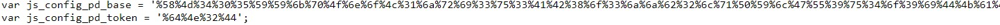
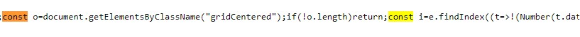
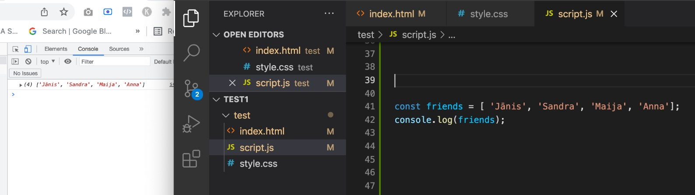
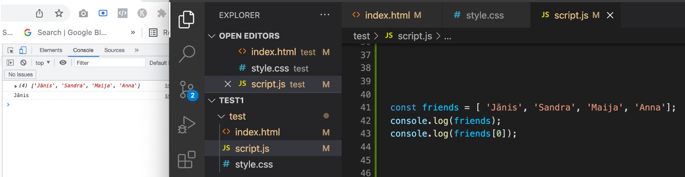
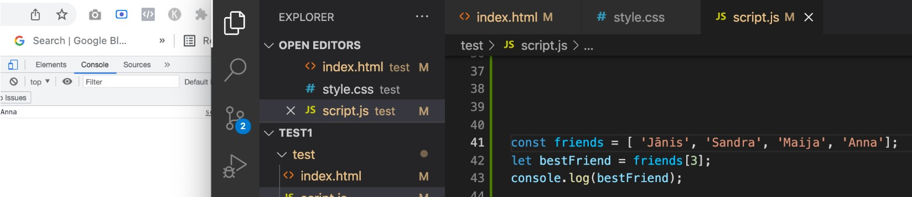
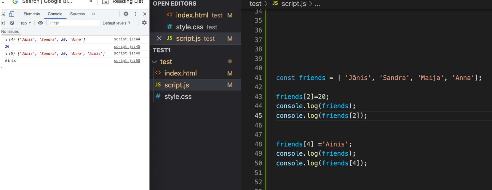
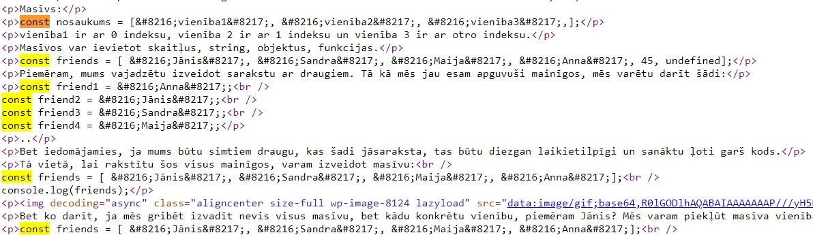

<!DOCTYPE html>
<html>
<head>
<title>Page Title</title>
</head>
<body>

<h1>JavaScript pētijums</h1>

ar mainīgo izmantošanu

<h4>"var" atradu RTU mājas lapā</h4>

ar masīvu izmantošanu

<h4>"const" atradu pinterestā</h4>

dažādu metožu izmantošanu saistībā ar masīviem

<h4>Pirmais variants </h4>

<h4>Otrais variants </h4>

<h4>Trešais variants </h4>

<h4>Ceturtais variants </h4>

<h4>Piektais variants </h4>
<h3>dgwebfactory.com</h3>

</body>
</html>