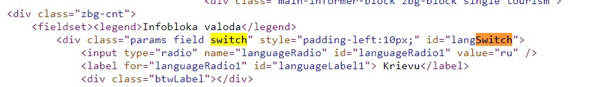
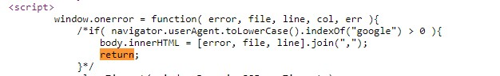

<!DOCTYPE html>
<html>
<head>

</head>
<body>

<h1 style="background-color:rgb(255, 0, 0);">JavaScript pētijums</h1>

ar mainīgo izmantošanu

<h4 style="color:red;">"var" atradu RTU mājas lapā</h4>

ar masīvu izmantošanu

<h4 style="color:red;">"const" atradu pinterestā</h4>

dažādu metožu izmantošanu saistībā ar masīviem

<h4 style="color:red;">Pirmais variants </h4>

<h4 style="color:red;">Otrais variants </h4>

<h4 style="color:red;">Trešais variants </h4>

<h4 style="color:red;">Ceturtais variants </h4>

<h4 style="color:red;">Piektais variants </h4>
<h3>dgwebfactory.com</h3>

ar nosacījuma operatora (if) izmantošanu

<h4 style="color:red;">"if" atradu eklasē</h4>

ar pārslēgšanas operatora (switch) izmantošanu

<h6>switch (pārslēgšanās, pārlēkšanas) konstrukcija. Šāda veida konstrukciju parasti izmanto, lai pārslēgtos starp ļoti dažādiem, savstarpēji nesaistītiem nosacījumiem. Parasti šīs konstrukcijas var izveidot arī ar iepriekš aprakstīto ja…, citādi ja…, citādi… konstrukciju, tomēr tādā gadījumā ir jāizmanto daudz vairāk „nevajadzīgu” koda daļu, kas padara- 19 JavaScript kodu apjomīgāku un tā lejupielādēšanu un izpildes laiku ilgāku.</h6>
<h2>šo paraugu atradu gismeteo mājas lapā</h2>

<h4>Sev paraugu atraadu izmantojot ChatGPT</h4>>

ar cikla operatora (for) izmantošanu

<h6>www.w3schools.com/</h6>>

ar cikla operatora (while) izmantošanu

<h6>www.w3schools.com/</h6>>

<h1>Funkcijas definēšana</h1>

ar funkcijas definēšanu (klasiskais paņēmiens - function vārds(argumenti) {darbības; return ...;})

<h6>www.w3schools.com/</h6>>

ar funkcijas definēšanu (anonīma funkcija)

<h6>www.w3schools.com/</h6>>

ar funkcijas definēšanu (anonīmas funkcijas nosaukšana ar piešķiršanu)

<h6>www.w3schools.com/</h6>>

ar funkcijas definēšanu (ar => paņēmienu)

<h6>www.w3schools.com/</h6>>

ar funkcijas izsaukšanu (darbināšanu)

<h6>www.w3schools.com/</h6>>

ar pagaidu papildu references izveidošanu eksistējošam objektam - kompaktākai rakstīšanai 

<h6>www.w3schools.com/</h6>>

</body>
</html>