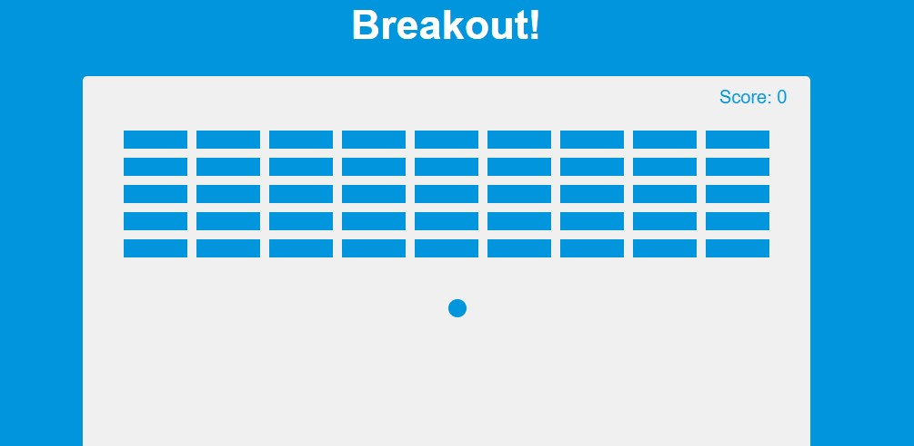

# Izlaušanās! Spēle
<h4 style="color:red;">Breakout! </h4>

## Projekta specifikācijas

-Zīmēt elementus uz audekla
-Izmantot audekla ceļus, lai zīmētu formas
-Pievienot animāciju ar requestAnimationFrame(cb)
-Pārvietot lāpstiņu, izmantojot bultiņu taustiņus
-Pievienot sadursmju noteikšanu
-Saglabāt punktus
-Pievienot noteikumu pogu ar slīdni

# JS koda "audits"

## Mainīgie
### DOM elementi:
- rulesBtn, closeBtn, rules, canvas, ctx: Šie mainīgie glabā atsauces uz HTML elementiem, kas ļauj interaktēt ar DOM un veikt grafiskās operācijas uz <canvas> elementa.

### Spēles stāvokļa mainīgie:
- score: Glabā spēlētāja punktu skaitu.
brickRowCount, brickColumnCount, delay: Glabā ķieģeļu izvietojuma un spēles restartēšanas laika iestatījumus.

### Objekti:
- ball: Glabā bumbas īpašības, piemēram, pozīciju, izmēru, ātrumu un redzamību.
- paddle: Glabā lāpstiņas īpašības, piemēram, pozīciju, izmēru, ātrumu un redzamību.
- brickInfo: Glabā ķieģeļu īpašības, piemēram, izmēru, nobīdi un redzamību.
- bricks: Masīvs, kas satur ķieģeļu objektus, kuri tiek ģenerēti sākotnēji un tiek atjaunināti spēles laikā.

## Nosacījuma operatori
Nosacījuma operatori tiek plaši izmantoti, lai kontrolētu spēles loģiku:

### Klaviatūras notikumu apstrāde:
- if (e.key === 'Right' || e.key === 'ArrowRight'): Pārbauda, vai ir nospiesta labā bultiņa, lai pārvietotu lāpstiņu pa labi.
- if (e.key === 'Left' || e.key === 'ArrowLeft'): Pārbauda, vai ir nospiesta kreisā bultiņa, lai pārvietotu lāpstiņu pa kreisi.
- if (e.key === 'Right' || e.key === 'ArrowRight' || e.key === 'Left' || e.key === 'ArrowLeft'): Pārbauda, vai ir atlaižot bultiņu taustiņi.

### Sadursmes detektēšana:
- if (ball.x + ball.size > canvas.width || ball.x - ball.size < 0): Pārbauda, vai bumba atsitas pret sānu sienām.
- if (ball.y + ball.size > canvas.height || ball.y - ball.size < 0): Pārbauda, vai bumba atsitas pret augšējo vai apakšējo sienu.
- if (ball.x - ball.size > paddle.x && ball.x + ball.size < paddle.x + paddle.w && ball.y + ball.size > paddle.y): Pārbauda, vai bumba atsitas pret lāpstiņu.
- if (brick.visible): Pārbauda, vai ķieģelis ir redzams un vai tam ir notikusi sadursme ar bumbu.
- if (score % (brickRowCount * brickColumnCount) === 0): Pārbauda, vai visi ķieģeļi ir iznīcināti.

### Spēles beigas:
- if (ball.y + ball.size > canvas.height): Pārbauda, vai bumba sasniedz apakšējo robežu, kas norāda uz zaudējumu.

## Cikla operatori
Cikla operatori tiek izmantoti, lai iterētu caur ķieģeļiem un veiktu zīmēšanas vai sadursmes pārbaudes:

### Ķieģeļu ģenerēšana:
- for (let i = 0; i < brickRowCount; i++) { ... }
- for (let j = 0; j < brickColumnCount; j++) { ... }

### Sadursmes un zīmēšanas funkcijas:
- bricks.forEach(column => { column.forEach(brick => { ... }) })

## Funkcijas
### Zīmēšanas funkcijas:
- drawBall(): Zīmē bumbu.
- drawPaddle(): Zīmē lāpstiņu.
- drawScore(): Zīmē punktus.
- drawBricks(): Zīmē ķieģeļus.

### Kustības funkcijas:
- movePaddle(): Pārvieto lāpstiņu atkarībā no klaviatūras ievades.
- moveBall(): Pārvieto bumbu un pārbauda sadursmes ar sienām, lāpstiņu un ķieģeļiem.

### Spēles loģika:
- increaseScore(): Palielina punktus un pārbauda, vai visi ķieģeļi ir iznīcināti, lai restartētu spēli.
- showAllBricks(): Parāda visus ķieģeļus.
- draw(): Galvenā funkcija, kas zīmē un atjauno spēles stāvokli.
- update(): Atjauno spēles animāciju.

### Notikumu klausītāji:
- keyDown(e): Apstrādā bultiņu taustiņu nospiešanu.
- keyUp(e): Apstrādā bultiņu taustiņu atlaišanu.
- document.addEventListener('keydown', keyDown): Pievieno klausītāju klaviatūras taustiņu nospiešanai.
- document.addEventListener('keyup', keyUp): Pievieno klausītāju klaviatūras taustiņu atlaišanai.
- rulesBtn.addEventListener('click', () => rules.classList.add('show')): Pievieno klausītāju noteikumu pogai.
- closeBtn.addEventListener('click', () => rules.classList.remove('show')): Pievieno klausītāju aizvēršanas pogai.

## Darbību secība (algoritms, biznesa loģika)
### Inicializācija:
- Inicializē mainīgos un iestata sākotnējos spēles parametrus (bumbas, lāpstiņas pozīcijas, ķieģeļi).

### Notikumu klausītāji:
- Pievieno klausītājus bultiņu taustiņu nospiešanai un atlaišanai.
- Pievieno klausītājus noteikumu pogai, lai parādītu vai paslēptu spēles noteikumus.

### Zīmēšanas funkcijas:
- Definē funkcijas bumbas, lāpstiņas, ķieģeļu un punktu zīmēšanai.

### Sadursmes detektēšana:
- moveBall() funkcija pārbauda sadursmes starp bumbu un ķieģeļiem vai lāpstiņu.

### Galvenā zīmēšanas un spēles loģikas funkcija:
- draw() funkcija zīmē visus spēles elementus un atjauno bumbas un lāpstiņas pozīcijas.

### Animācija:
- requestAnimationFrame(update) nodrošina nepārtrauktu spēles animāciju, izsaucot update() funkciju katrā kadru.

## Kopējā struktūra
Kods ir labi strukturēts, ar skaidri definētām funkcijām, kas atbild par konkrētiem uzdevumiem. Tas ļauj viegli saprast un uzturēt spēles loģiku. Funkcijas ir sadalītas tā, lai katra atbildētu par noteiktu uzdevumu, piemēram, zīmēšanu, kustību vai sadursmju noteikšanu, kas padara kodu modulāru un atkārtoti lietojamu.